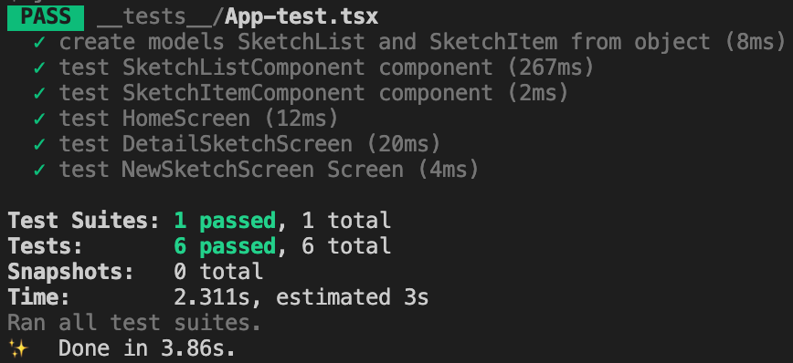

# RNSketchNote

A demo drawing app which is based on React Native with MobX and SVG

## Nav
- [Description](#desc)
- [Stack](#stack)
- [Project structure ](#project-structure)
- [Testing ](#testing)
- [Usage ](#usage)

## Description 
The main functions of this App:
* **Drawing component** is based on [React Native SVG](https://github.com/react-native-community/react-native-svg) to implement `Polyline` and use `PanResponder` to detect taps
* Create a new Sketch
* Save sketches to AsyncStorage
* Delete all sketches from AsyncStorage
* Edit selected sketch and save it by using AsyncStorage

## Stack 
* Architecture: MVVM with MobX
* [React Native 0.63](https://reactnative.dev)
* State: [MobX](http://mobx.js.org)
* [TypeScript](https://www.typescriptlang.org)
* [@react-native-community/react-native-svg](https://github.com/react-native-community/react-native-svg)

## Project structure 
* `__mocks__` - mock files for Native Modules
* `__tests__` - test cases
* `src`
  * `components` - UI components
  * `models` - models SketchList and SketchItem
  * `screens` - screen components
  * `services` - services 
  * `stores` - MobX stores (ViewModel)
  * `utils` - utilities and config

## Testing 
Run `yarn test`

 

## Usage 
1. Make sure that you have XCode and Android Studio
2. Git clone this repo
3. Run `yarn` or `npn i`
4. Run `yarn ios` or `yarn android`